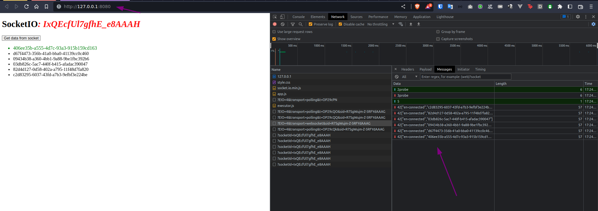

# node-socketio
Testing node socket.io lib


# Requirements
1. docker
2. docker-compose

# RUN
```sh
  docker-compose up
```
> Open your browser at: http://localhost:8080
> 

# References
* https://www.youtube.com/watch?v=OG_qqYzcfFk
* https://github.com/ErickWendel/upload-multiple-files-yt